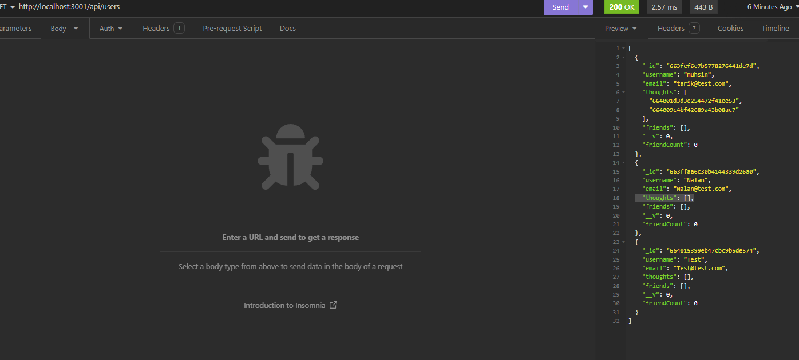
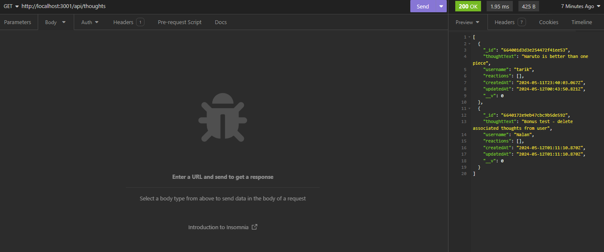

# social_network_api

## Muhsin Tarik Orgerim

  ## Table of Contents
  - [Description](#description)
  - [Usage](#usage)
  - [License](#license)
  - [Credits](#credits)
  - [Contribute](#contribute)
  

  ## Visuals
  
  
 

  # Description
  A social media network api for backend routes.

  ## Usage
  Can be used to store User data, Thoughts, Reaction and have relational database in between such as (friendslist, thoughts by a user)
  ## Installation
  N/A

  ## Credits
  - Rutgers Bootcamp Resources.

  ## Contribute
  - Create a fork of the project
  - Create your branch
  - Make sure to commit your changes
  - Push the branch
  - Do a Pull Request

  ## Deployment
  - Link to my repo: https://github.com/tarikorg/social_network_api
  - Deployed link: [WALKTHROUGH](https://drive.google.com/file/d/1hqpSG62mfm3Tnl4NAiAwL1ZRCpyKr5j_/view?usp=sharing)
   
  ## Questions
  - Github username: https://github.com/tarikorg
  - Email: myku1771@gmail.com

  ## License
  This repository is under the MIT license.
